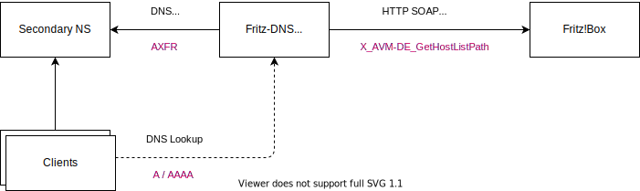

<!--
SPDX-FileCopyrightText: 2023 Steffen Vogel <post@steffenvogel.de>
SPDX-License-Identifier: Apache-2.0
-->

# Fritz-DNS

In my home network, I am using an AVM FRITZ!Box Cable 6690. It handles DHCP, DNS, Wifi and [recently also interfaces my home network via WireGuard to my servers](https://en.avm.de/news/the-latest-news-from-fritz/2022/wireguard-vpn-has-never-been-so-easy/).

Just like the venerable [Dnsmasq](https://thekelleys.org.uk/dnsmasq/doc.html) AVM’s FRITZ!OS uses hostnames learned from its DHCP leases and makes them resolvable via its internal DNS server.

Unfortunately, this feature in FRITZ!OS has some limitations:

- The name of the DNS Zone is hard coded to fritz.box and can not be adjusted. Hence, the resolvable names have the following schema: myhostname.fritz.box
- The internal DNS server only supports recursive DNS looks. It does not act as an authoritative DNS server. Hence the local zone can not be delegated.
- AXFR zone transfers are not supported.

My solution to these shortcomings is _Fritz-DNS_ which:

- is a small tool written in the Go programming language.
- is a small authoritative DNS server which serves A/AAAA resource records for local hosts connected to an AVM Fritz Box home WiFi router.
- can be used in a hidden master configuration as it supports AXFR zone transfers.
- uses the custom extension (X_AVM-DE_GetHostListPath) of the TR-064 Hosts SOAP-API as documented here to retrieve a list of local hosts.
- supports the generation of AAAA (IPv6) resource records based on the hosts MAC addresses using 64-Bit Extended Unique Identifier (EUI-64) - and a configured unique local address (ULA) prefix.
- does not yet support PTR resource records (to be implemented…)
- is licensed under the Apache 2.0 license

You can find Fritz-DNS at GitHub: https://github.com/stv0g/fritz-dns

Here is a small figure illustrating the interaction of Fritz-DNS with the Fritz!Box and other DNS servers / clients:



## CLI Usage

```
Usage of fritz-dns
  -ipv6-ula-prefix string
    	Fritz Box IPv6 ULA Prefix (default "fd00::/64")
  -pass string
    	FritzBox password
  -port int
    	Listen port (default 53)
  -soa-expire duration
    	SOA expire value (default 744h0m0s)
  -soa-mbox string
    	SOA mailbox value
  -soa-minttl duration
    	SOA minimum TTL value (default 1h0m0s)
  -soa-ns string
    	Authorative DNS server for the zone
  -soa-refresh duration
    	SOA refresh value (default 2h0m0s)
  -soa-retry duration
    	SOA retry value (default 1h0m0s)
  -ttl duration
    	default TTL values for records (default 5m0s)
  -url string
    	FritzBox URL (default "http://fritz.box/")
  -user string
    	FritzBox username (default "admin")
  -zone string
    	DNS Zone (default "fritz.box.")
```

## Author

- Steffen Vogel ([@stv0g](https://github.com/stv0g))

## License

Copyright 2022 Steffen Vogel

Licensed under the Apache License, Version 2.0 (the "License");
you may not use this file except in compliance with the License.
You may obtain a copy of the License at

    http://www.apache.org/licenses/LICENSE-2.0

Unless required by applicable law or agreed to in writing, software
distributed under the License is distributed on an "AS IS" BASIS,
WITHOUT WARRANTIES OR CONDITIONS OF ANY KIND, either express or implied.
See the License for the specific language governing permissions and
limitations under the License.

## References

- [My Blog post about Fritz-DNS](https://noteblok.net/2023/01/08/fritz-dns-an-authoritative-dns-server-for-avm-fritzbox-routers/)
- [AVM's TR-064 Support - Hosts](https://avm.de/fileadmin/user_upload/Global/Service/Schnittstellen/hostsSCPD.pdf)
